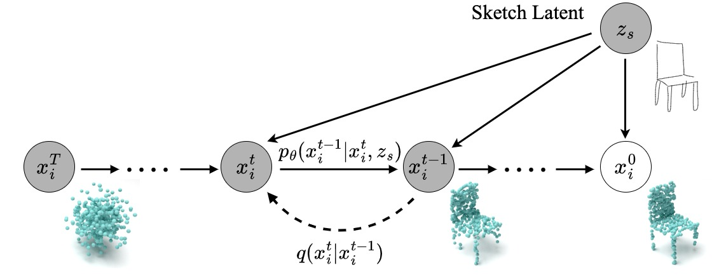
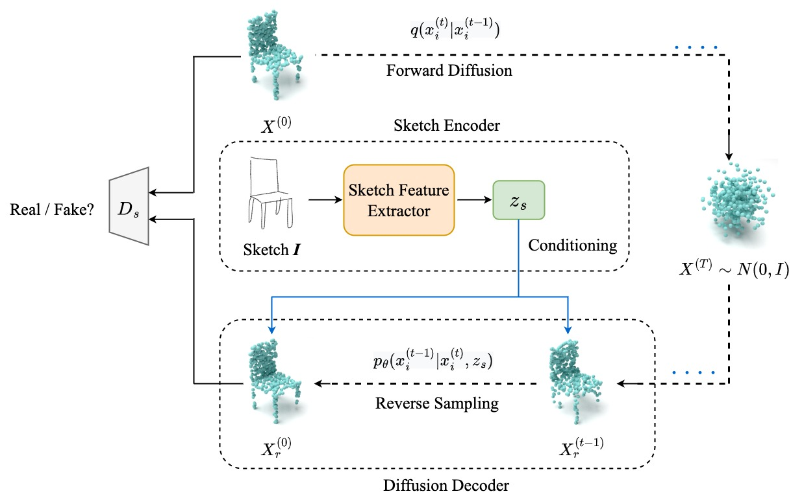

# A Diffusion-ReFinement Model for Sketch-to-Point Modeling
In this repository, you can find the official PyTorch implementation of A Diffusion-ReFinement Model for Sketch-to-Point Modeling (ACCV2022, Oral).  
The code will be publicly available soon.

## The reconstruction process

## The overview of our proposed model’ s framework

